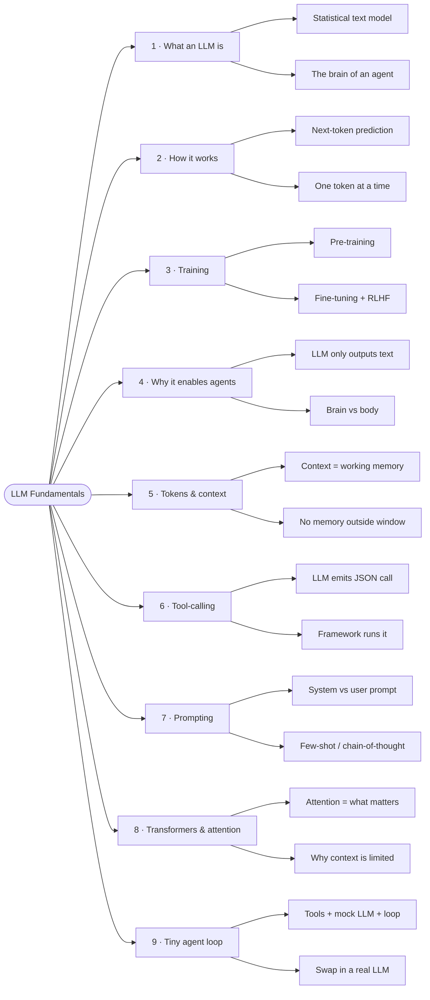

# 01 · LLM Fundamentals

**Status:** ✅ Done

Understanding the "brain" behind AI agents: what a Large Language Model is, how it works, and why it enables agents.

## Mindmap

## Notes

Each point lives in its own file under [`notes/`](./notes). Check the box as you finish it.

| # | Point | Status | Note |
|---|-------|--------|------|
| 1 | What an LLM is | ✅ | [01-what-is-an-llm.md](./notes/01-what-is-an-llm.md) |
| 2 | How an LLM works (next-token prediction) | ✅ | [02-how-llms-work.md](./notes/02-how-llms-work.md) |
| 3 | How it's trained (pre-training, fine-tuning, RLHF) | ✅ | [03-training.md](./notes/03-training.md) |
| 4 | Why an LLM enables "agents" | ✅ | [04-why-agents.md](./notes/04-why-agents.md) |
| 5 | Tokens and the context window | ✅ | [05-tokens-and-context-window.md](./notes/05-tokens-and-context-window.md) |
| 6 | How tool-calling actually works (JSON under the hood) | ✅ | [06-tool-calling.md](./notes/06-tool-calling.md) |
| 7 | Prompting and system prompts | ✅ | [07-prompting-and-system-prompts.md](./notes/07-prompting-and-system-prompts.md) |
| 8 | Transformers and attention (architecture deep dive) | ✅ | [08-transformers-and-attention.md](./notes/08-transformers-and-attention.md) |
| 9 | Build a tiny agent loop myself | ✅ | [09-build-a-tiny-agent-loop.md](./notes/09-build-a-tiny-agent-loop.md) · [project](./projects/tiny-agent-loop/) |

## Projects

- [tiny-agent-loop](./projects/tiny-agent-loop/) — a minimal, runnable agent (tools, mock LLM, JSON tool-calling, the loop). No API key, no dependencies.
