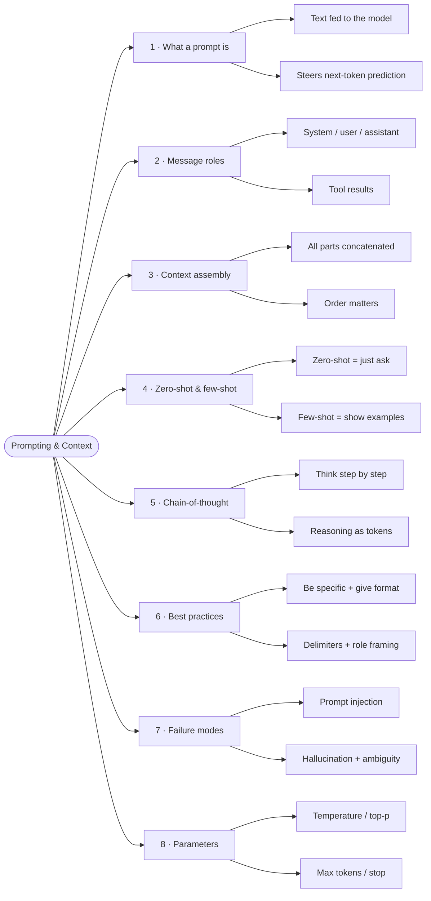

# 02 · Prompting & Context

**Status:** � Learning

How to talk to an LLM so it does what you want. Prompting is the highest-leverage skill in AI engineering — every other topic (agents, RAG, fine-tuning) depends on getting the prompt right.

## Mindmap

## Notes

Each point lives in its own file under [`notes/`](./notes).

| # | Point | Status | Note |
|---|-------|--------|------|
| 1 | What a prompt really is | ✅ | [01-what-is-a-prompt.md](./notes/01-what-is-a-prompt.md) |
| 2 | Message roles (system / user / assistant / tool) | ✅ | [02-message-roles.md](./notes/02-message-roles.md) |
| 3 | Context assembly | ✅ | [03-context-assembly.md](./notes/03-context-assembly.md) |
| 4 | Zero-shot & few-shot prompting | ✅ | [04-zero-shot-few-shot.md](./notes/04-zero-shot-few-shot.md) |
| 5 | Chain-of-thought & reasoning | ✅ | [05-chain-of-thought.md](./notes/05-chain-of-thought.md) |
| 6 | Prompt structure & best practices | ✅ | [06-best-practices.md](./notes/06-best-practices.md) |
| 7 | Failure modes (injection, hallucination, ambiguity) | ✅ | [07-failure-modes.md](./notes/07-failure-modes.md) |
| 8 | Prompting parameters (temperature, top-p, max tokens) | ✅ | [08-parameters.md](./notes/08-parameters.md) |

## Projects

_(none yet — a prompt-engineering playground is a good candidate)_
